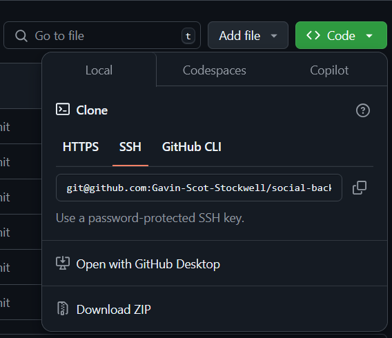

# Social Back end

## License
[](https://mit-license.org/)


# Table Of Contents
* [Description](#description)
* [Installation](#installation)
* [Usage](#usage)
* [License](#license)
* [Contributing](#contributing)
* [Tests](#tests)
* [Questions](#questions)


## Description
Showing off the backend server side of a server, work in concept  

## Installation
How to download
* Go to get hub page https://github.com/Gavin-Scot-Stockwell/social-back-end
* either download via the zip file or do a pull form github
 


## Usage
To see just the back in of a website


## Contributing
* Gavin Stockwell -ts, mongoDB, mongoose, & express 


## Tests
* Before testing make user to npm i, run seed and npm start
* You must have insomnia to work with this

Here are all the routes you can test:

**GET**  
http://localhost:3001/api/users  
(gets all users)

**POST**  
http://localhost:3001/api/users  
```json
{
  "username": "Gavin Scot Stockwell",
  "email": "gsstockwell@gmail.com"
}
```  
(creates a new user, please use the format above)

**GET**  
http://localhost:3001/api/users/:userID  
(getting one user)

**PUT**  
http://localhost:3001/api/users/:userID  
```json
{
  "username": "Gavin Scot Stockwell",
  "email": "test@gmail.com"
}
```  
(updating a user, please use the format above)

**DELETE**  
http://localhost:3001/api/users/67ba3d10c6689f2c9492ed61  
(deletes a user)

**GET**  
http://localhost:3001/api/thoughts  
(gets all thoughts from users)

**POST**  
http://localhost:3001/api/thoughts  
```json
{
  "thoughtText": "My name is Gavin Scot Stockwell",
  "username": "Gavin Scot Stockwell",
  "userId": "**"
}
```  
(creates a new post from a user, please use the format from above)

**GET**  
http://localhost:3001/api/thoughts/:thoughtID  
(finds a thought from a user)

**POST**  
http://localhost:3001/api/thoughts/:thoughtID  
```json
{
  "thoughtText": "TEST",
  "username": "Gavin Scot Stockwell",
  "userId": "**"
}
```  
(creates a new thought from a user, please use the format from above)

**PUT**  
http://localhost:3001/api/thoughts/:thoughtID  
```json
{
  "thoughtText": "TEST",
  "username": "Gavin Scot Stockwell",
  "userId": "**"
}
```  
(updates a new thought from a user, please use the format from above)

**DELETE**  
http://localhost:3001/api/thoughts/:thoughtID  
(deletes the users thought)

**POST**  
http://localhost:3001/api/thoughts/:thoughtID/reactions  
```json
{
  "reactionBody": "This is a reaction",
  "username": "jane_doe"
}
```  
(creates a reaction on a different users post, please use the format from above)

**DELETE**  
http://localhost:3001/api/thoughts/:thoughtID/reactions/:reactionsID  
(deletes the reaction)

## Questions
* GitHub-username https://github.com/Gavin-Scot-Stockwell
* Email-address gsstockwell@gmail.com
* Video that shows how it works https://youtu.be/OWFhft5DD64 

